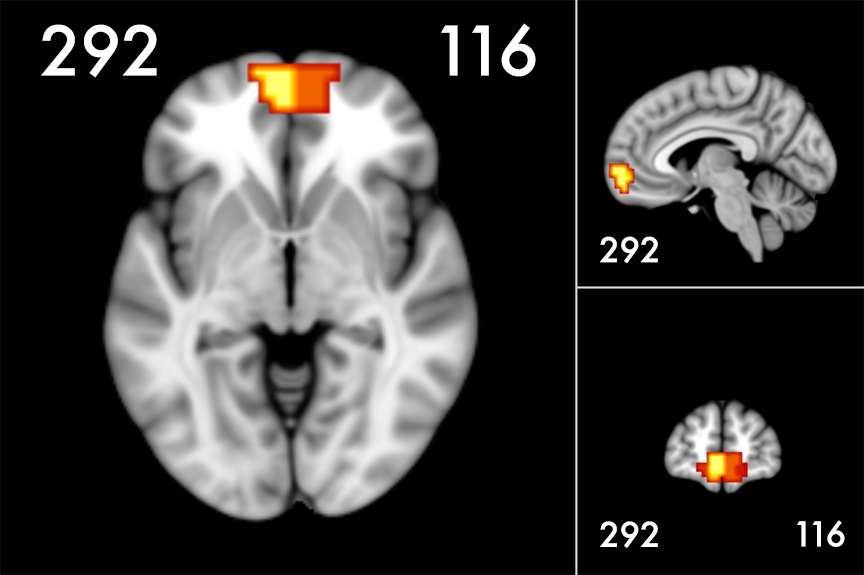

```{r setup, include=FALSE}
knitr::opts_chunk$set(fig.width=8, fig.height=6, warning=FALSE, message=FALSE)
```

# ROIs from the [Craddock et al. (2012) parcellation atlas](http://ccraddock.github.io/cluster_roi/atlases.html)
Mean parameter estimates were extracted from parcel 292 and 116. The parcellation atlas can be found in ``functional-workshop/data/ROIs/craddock_all.nii.gz`. This atlas has multiple volumes within the 4D file, and we extracted from the K=400 atlas, which is the 31st volume in AFNI (index = 0 in AFNI).



# Extract mean parameter estimates
Run bash script to calculate mean parameter estimates for each subject, wave, and condition contrast (condition > rest) within each ROI using AFNI `3dmaskave`.

Path to bash script: `functional-workshop/code/ROI_analysis/extract_parameterEstimates.sh`

Dependencies:  
* AFNI must be installed  
* Path to AFNI script must be in your `~/.bashrc` file  
```{bash, eval=FALSE}
#!/bin/bash
. ~/.bashrc

# This script extracts mean parameter estimates and SDs within an ROI or parcel
# from subject FX condition contrasts (condition > rest) for each wave. Output is 
# saved as a text file in the output directory.

# Set paths and variables
# ------------------------------------------------------------------------------------------
# paths

con_dir='./data/FX_models' #fx contrast directory
atlas_dir='./data/ROIs' #roi/parcellation atlas directory 
output_dir='./results/ROI_analysis' #roi/parcellation output directory
rx_model='./results/AFNI/all+tlrc' #rx model (for atlas alignment only)

# variables
subjects=`cat ./data/subject_list.txt`
parcellation_atlas=(craddock_all.nii.gz) #roi/parcellation atlas file
parcellation_map=(31) #parcellation map number (if applicable)
aligned_parcellation_map=(aligned_craddock_400) #aligned roi/parcellation map name
aligned_parcellation_num=(116 292) #parcellation number(s) to extract from; use $(seq 1 N) where N is the total number of parcels to extract from all
waves=(t1 t2 t3) #waves or task names
fx_cons=(con_0001 con_0002 con_0003 con_0004) #fx con files to extract from

if [ ! -f $output_dir/parameterEstimates.txt ]; then
	# Align roi/parcellation map to data
	# ------------------------------------------------------------------------------------------
	echo "aligning parcellation map"
	if [ -f $atlas_dir/${aligned_parcellation_map}+tlrc.BRIK ]; then
		echo "aligned parcellation map already exists"
	else 
	3dAllineate -source $atlas_dir/$parcellation_atlas[$parcellation_map] -master $rx_model -final NN -1Dparam_apply '1D: 12@0'\' -prefix $atlas_dir/$aligned_parcellation_map
	fi

	# Extract mean parameter estimates and SDs for each subject, wave, contrast, and roi/parcel
	# ------------------------------------------------------------------------------------------

	for sub in ${subjects[@]}; do 
		for wave in ${waves[@]}; do 
			for con in ${fx_cons[@]}; do 
				for num in ${aligned_parcellation_num[@]}; do 
					echo ${sub} ${wave} ${con} ${num} `3dmaskave -sigma -quiet -mrange $num $num -mask $atlas_dir/${aligned_parcellation_map}+tlrc $con_dir/${sub}_${wave}_${con}.nii` >> $output_dir/parameterEstimates.txt
				done
			done
		done
	done
else
	echo "parameterEstimates.txt already exists"
fi
```

The output will be saved in a text file `functional-workshop/results/ROI_analysis/parameterEstimates.txt`
```{r}
if(!require(knitr)){
  install.packages('knitr',repos=osuRepo)
}
if(!require(dplyr)){
  install.packages('dplyr',repos=osuRepo)
}

read.table('../../results/ROI_analysis/parameterEstimates.txt', sep = "", fill = TRUE, stringsAsFactors=FALSE) %>%
  head(10) %>%
  kable(format = 'pandoc')
```

# Load packages
```{r, load packages}
# set mirror from which to download packages
osuRepo = 'http://ftp.osuosl.org/pub/cran/'

if(!require(tidyverse)){
  install.packages('tidyverse',repos=osuRepo)
}
if(!require(lme4)){
  install.packages('lme4',repos=osuRepo)
}
if(!require(lmerTest)){
  install.packages('lmerTest',repos=osuRepo)
  }
if(!require(wesanderson)){
  install.packages('wesanderson',repos=osuRepo)
  }
```

# Load data
```{r, load data}
# load parameter estimate .csv file
data = read.table('../../results/ROI_analysis/parameterEstimates.txt', sep = "", fill = TRUE, stringsAsFactors=FALSE)

# load age covariates and rename variables
age = read.csv('../../data/covariates/age.csv') %>%
  rename("subjectID" = Subj,
         "wave" = wavenum)
```

# Tidy data
## Specify your variables names and levels
```{r, tidy data}
# tidy raw data
data1 = data %>% 
  # rename variables
  rename('subjectID' = V1,
         'wave' = V2,
         'con' = V3,
         'parcellation' = V4,
         'beta' = V5,
         'sd' = V6) %>%
  # convert con file names to condition names
  mutate(target = ifelse(con %in% c('con_0001', 'con_0002'), 'self', 'other'), 
         domain = ifelse(con %in% c('con_0001', 'con_0003'), 'academic', 'social'), 
  # change data type to factor
         parcellation = as.factor(parcellation),
         target = as.factor(target),
         domain = as.factor(domain)) %>%
  # change to integer
  extract(wave, 'wave', 't([0-3]{1})') %>%
  mutate(wave = as.integer(wave))
```

# Merge data, add age to the data frame and center
```{r, merge data}
merged = left_join(data1, age, by = c('subjectID', 'wave')) %>%
  mutate(age_c = age-mean(age, na.rm=TRUE))

# print data frame header
merged %>%
  head(16) %>%
  kable(format = 'pandoc')
```

# Remove missing data to run LME models
```{r, remove missing data}
data.complete = merged %>%
  na.omit(.)

# print number of rows
cat('raw data: ', nrow(merged))
cat('\ncomplete data: ', nrow(data.complete))
```

# Run LME models within parcel 292 and compare 
Predict parameter estimates from task conditions (target and domain) and age within parcel 292.

## Linear effect of age, random intercepts only
```{r, model.1}
model.1 = lmer(beta ~ target*domain*age_c + (1 | subjectID), data=filter(data.complete, parcellation == 292))
summary(model.1)
```

## Linear effect of age, random intercepts and age slopes 
```{r, model.2}
model.2 = lmer(beta ~ target*domain*age_c + (1 + age_c | subjectID), data=filter(data.complete, parcellation == 292))
summary(model.2)
```

## Compare models
**model.1:** `beta ~ target * domain * age_c + (1 | subjectID)`
  
**model.2:** `beta ~ target * domain * age_c + (1 + age_c | subjectID)`

```{r, compare models}
anova(model.1, model.2) %>%
  `row.names<-`(c('model.1', 'model.2')) %>%
  kable()
```

Adding age as a random effect does not significantly improve the model fit.  

# Visualize raw data
```{r, palette}
# set color palette
palette = wes_palette("Zissou", 2, type = "continuous")
```

## Plot fitted curves for parcels 292 and 116
### Main effect of target
```{r, raw fitted main effect}
ggplot(data.complete, aes(x = age, 
                          y = beta, 
                          group = interaction(subjectID, target, domain), 
                          color = target)) +
  geom_point(size = .5, alpha = .1) + 
  geom_line(alpha = .1) + 
  geom_line(aes(group=target), size = 1.5, stat = 'smooth', method = 'lm', formula = y ~ poly(x,2)) + 
  facet_wrap(~parcellation, ncol = 2) +
  geom_hline(yintercept = 0, color = 'gray') +
  scale_color_manual(breaks = c('self', 'other'), values = c(self=palette[2], other=palette[1])) +
  scale_x_continuous(breaks=c(10,13,16)) +
  coord_cartesian(ylim=c(-1,1)) +
  theme_minimal(base_size = 18)
```

### Interaction between target and domain
```{r, raw fitted interaction}
ggplot(data.complete, aes(x = age, 
                          y = beta, 
                          group = interaction(subjectID, target, domain), 
                          color = target, 
                          linetype = domain)) +
  geom_point(size = .5, alpha = .1) + 
  geom_line(alpha = .1) + 
  geom_line(aes(group=interaction(target,domain)), size = 1.5, stat = 'smooth', method = 'lm', formula = y ~ poly(x,2)) + 
  facet_wrap(~parcellation, ncol = 2) +
  geom_hline(yintercept = 0, color = 'gray')+
  scale_color_manual(breaks = c('self', 'other'), values = c(self=palette[2], other=palette[1]))+
  scale_x_continuous(breaks=c(10,13,16)) +
  coord_cartesian(ylim=c(-1,1)) +
  theme_minimal(base_size = 18)
```

## Plot LOESS curves for parcels 292 and 116
### Main effect of target
```{r, raw LOESS main effect}
ggplot(data.complete, aes(x = age, 
                          y = beta, 
                          group = interaction(subjectID, target, domain), 
                          color = target, 
                          linetype = domain)) +
  geom_point(size = .5, alpha = .1) + 
  geom_line(alpha = .1) + 
  geom_line(aes(group=target), size = 1.5, stat = 'smooth', method = 'loess') + 
  facet_wrap(~parcellation, ncol = 2) +
  geom_hline(yintercept = 0, color = 'gray')+
  scale_color_manual(breaks = c('self', 'other'), values = c(self=palette[2], other=palette[1]))+
  scale_x_continuous(breaks=c(10,13,16)) +
  coord_cartesian(ylim=c(-1,1)) +
  theme_minimal(base_size = 18)
```

### Interaction between target and domain
```{r, raw LOESS interaction}
ggplot(data.complete, aes(x = age, 
                          y = beta, 
                          group = interaction(subjectID, target, domain), 
                          color = target, 
                          linetype = domain)) +
  geom_point(size = .5, alpha = .1) + 
  geom_line(alpha = .1) + 
  geom_line(aes(group=interaction(target,domain)), size = 1.5, stat = 'smooth', method = 'loess') + 
  facet_wrap(~parcellation, ncol = 2) +
  geom_hline(yintercept = 0, color = 'gray')+
  scale_color_manual(breaks = c('self', 'other'), values = c(self=palette[2], other=palette[1]))+
  scale_x_continuous(breaks=c(10,13,16)) +
  coord_cartesian(ylim=c(-1,1)) +
  theme_minimal(base_size = 18)
```

# Visualize predicted values from model.1
Linear effect of age, random intercepts only

**model.1:** `beta ~ target * domain * age_c + (1 | subjectID)`

## Plot fitted curves for parcels 292 and 116
```{r, predict model.1}
# extract random effects formula from model.2 and reconstruct it to use with the `predict` function
REFormulaString = as.character(findbars(model.1@call$formula)[[1]])
REFormula = as.formula(paste0('~(', REFormulaString[[2]], REFormulaString[[1]], REFormulaString[[3]], ')'))

# get expected values for each observation based on model.2
data.complete$expected.1 <- predict(model.1, newdata = data.complete, re.form=REFormula)
data.complete$expected_mean.1 <- predict(model.1, newdata = data.complete, re.form=NA)
```

### Main effect of target
```{r, predicted main effect model.1}
ggplot(data.complete, aes(x = age, 
                          y = expected.1, 
                          group = interaction(subjectID, target, domain), 
                          color = target)) +
  geom_point(size = .5, alpha = .1) + 
  geom_line(alpha = .1) + 
  geom_line(aes(y = expected_mean.1, group=target), size = 1.5, stat = 'smooth', method = 'lm', formula = y ~ poly(x,2)) + 
  facet_wrap(~parcellation, ncol = 2) +
  geom_hline(yintercept = 0, color = 'gray') +
  scale_color_manual(breaks = c('self', 'other'), values = c(self=palette[2], other=palette[1])) +
  scale_x_continuous(breaks=c(10,13,16)) +
  coord_cartesian(ylim=c(-1,1)) +
  theme_minimal(base_size = 18)
```

### Interaction between target and domain
```{r, predicted interaction model.1}
ggplot(data.complete, aes(x = age, 
                          y = expected.1, 
                          group = interaction(subjectID, target, domain), 
                          color = target, 
                          linetype = domain)) +
  geom_point(size = .5, alpha = .1) + 
  geom_line(alpha = .1) + 
  geom_line(aes(y = expected_mean.1, group=interaction(target,domain)), size = 1.5, stat = 'smooth', method = 'lm', formula = y ~ poly(x,2)) + 
  facet_wrap(~parcellation, ncol = 2) +
  geom_hline(yintercept = 0, color = 'gray')+
  scale_color_manual(breaks = c('self', 'other'), values = c(self=palette[2], other=palette[1]))+
  scale_x_continuous(breaks=c(10,13,16)) +
  coord_cartesian(ylim=c(-1,1)) +
  theme_minimal(base_size = 18)
```

# Visualize predicted values from model.2
Linear effect of age, random intercepts and age slopes 

**model.2:** `beta ~ target * domain * age_c + (1 + age_c | subjectID)`

## Plot fitted curves for parcels 292 and 116
```{r, predict model.2}
# extract random effects formula from model.2 and reconstruct it to use with the `predict` function
REFormulaString = as.character(findbars(model.2@call$formula)[[1]])
REFormula = as.formula(paste0('~(', REFormulaString[[2]], REFormulaString[[1]], REFormulaString[[3]], ')'))

# get expected values for each observation based on model.2
data.complete$expected.2 <- predict(model.2, newdata = data.complete, re.form=REFormula)
data.complete$expected_mean.2 <- predict(model.2, newdata = data.complete, re.form=NA)
```

### Main effect of target
```{r, predicted main effect model.2}
ggplot(data.complete, aes(x = age, 
                          y = expected.2, 
                          group = interaction(subjectID, target, domain), 
                          color = target)) +
  geom_point(size = .5, alpha = .1) + 
  geom_line(alpha = .1) + 
  geom_line(aes(y = expected_mean.2, group=target), size = 1.5, stat = 'smooth', method = 'lm', formula = y ~ poly(x,2)) + 
  facet_wrap(~parcellation, ncol = 2) +
  geom_hline(yintercept = 0, color = 'gray') +
  scale_color_manual(breaks = c('self', 'other'), values = c(self=palette[2], other=palette[1])) +
  scale_x_continuous(breaks=c(10,13,16)) +
  coord_cartesian(ylim=c(-1,1)) +
  theme_minimal(base_size = 18)
```

### Interaction between target and domain
```{r, predicted interaction model.2}
ggplot(data.complete, aes(x = age, 
                          y = expected.2, 
                          group = interaction(subjectID, target, domain), 
                          color = target, 
                          linetype = domain)) +
  geom_point(size = .5, alpha = .1) + 
  geom_line(alpha = .1) + 
  geom_line(aes(y = expected_mean.2, group=interaction(target,domain)), size = 1.5, stat = 'smooth', method = 'lm', formula = y ~ poly(x,2)) + 
  facet_wrap(~parcellation, ncol = 2) +
  geom_hline(yintercept = 0, color = 'gray')+
  scale_color_manual(breaks = c('self', 'other'), values = c(self=palette[2], other=palette[1]))+
  scale_x_continuous(breaks=c(10,13,16)) +
  coord_cartesian(ylim=c(-1,1)) +
  theme_minimal(base_size = 18)
```