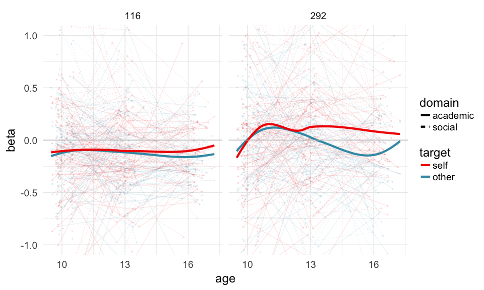
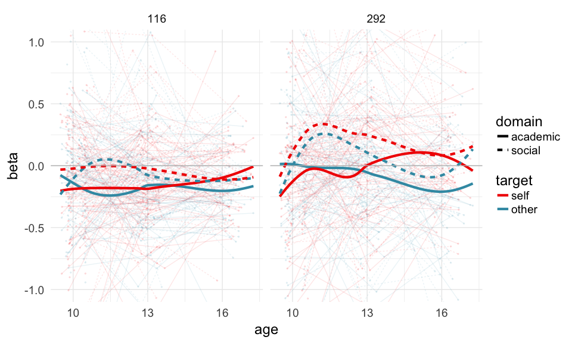
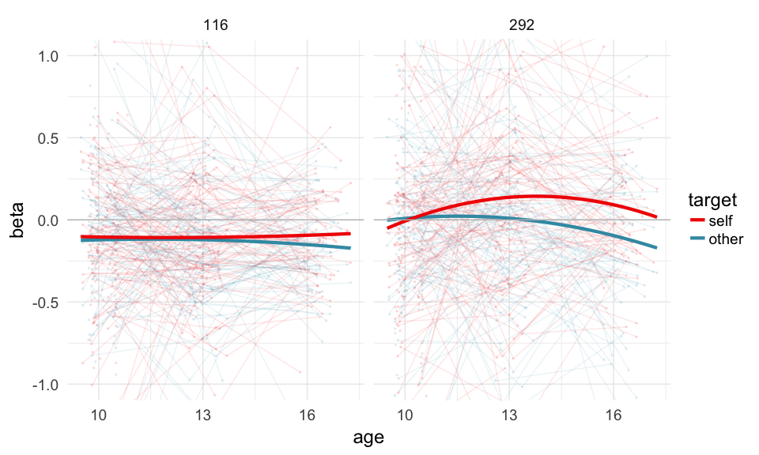
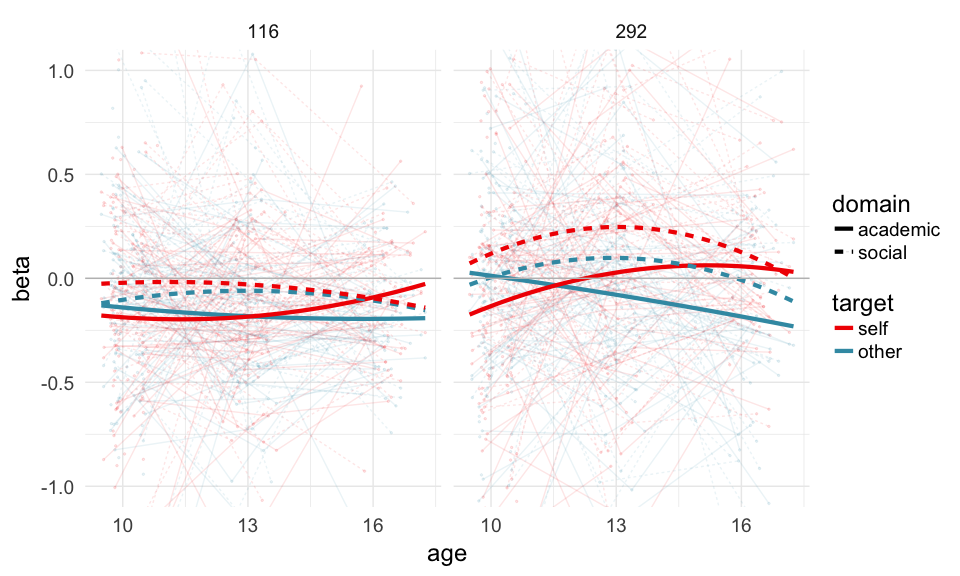
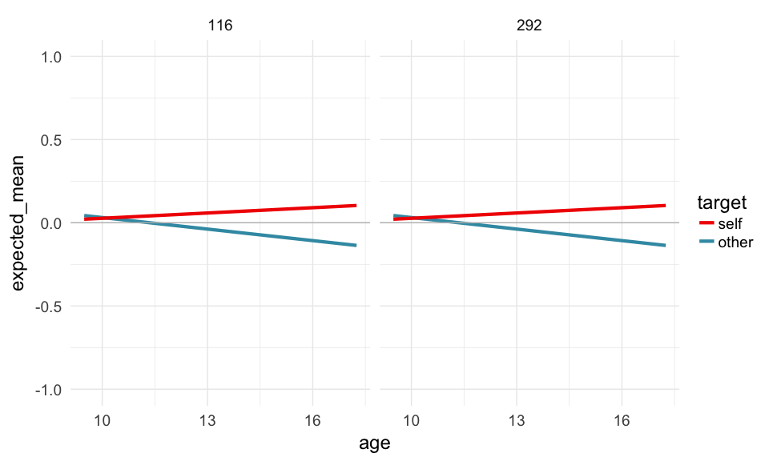
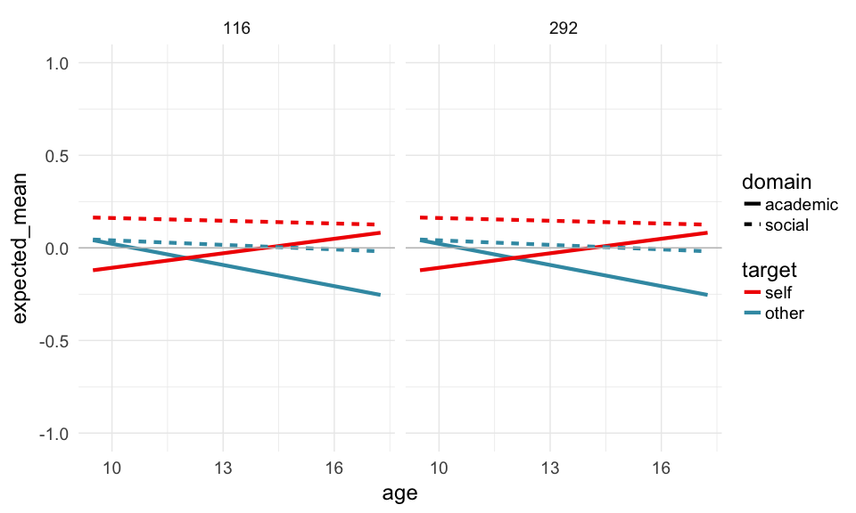

-   [Load packages](#load-packages)
-   [Load data](#load-data)
-   [Tidy data](#tidy-data)
    -   [Specify your variables names and
        levels](#specify-your-variables-names-and-levels)
-   [Merge data](#merge-data)
    -   [Add age to the dataframe, center age, and add quadratic age
        term](#add-age-to-the-dataframe-center-age-and-add-quadratic-age-term)
-   [Remove missing data](#remove-missing-data)
-   [Run LME models and compare](#run-lme-models-and-compare)
    -   [Linear effect of age, random intercepts and
        slopes](#linear-effect-of-age-random-intercepts-and-slopes)
    -   [Quadratic effect of age, random
        intercepts](#quadratic-effect-of-age-random-intercepts)
    -   [Compare models](#compare-models)
-   [Visualize raw data](#visualize-raw-data)
    -   [Plot LOESS curves for parcels 292 and
        116](#plot-loess-curves-for-parcels-292-and-116)
        -   [Main effect](#main-effect)
        -   [Interaction](#interaction)
    -   [Plot fitted curves for parcels 292 and
        116](#plot-fitted-curves-for-parcels-292-and-116)
        -   [Main effect](#main-effect-1)
-   [Visualize predicted values from
    model](#visualize-predicted-values-from-model)
    -   [Plot fitted curves for parcels 292 and
        116](#plot-fitted-curves-for-parcels-292-and-116-1)
        -   [Main effect](#main-effect-2)
        -   [Interaction](#interaction-1)

Load packages
=============

    library(tidyverse)
    library(lme4)
    library(lmerTest)
    library(wesanderson)

Load data
=========

    data = read.table('/Volumes/psych-cog/dsnlab/MDC/functional-workshop/results/ROI_analysis/parameterEstimates.txt', sep = "", fill = TRUE, stringsAsFactors=FALSE)
    age = read.csv('/Volumes/psych-cog/dsnlab/MDC/functional-workshop/data/covariates/age.csv') %>%
      rename("subjectID" = Subj,
             "wave" = wavenum)

Tidy data
=========

Specify your variables names and levels
---------------------------------------

    # tidy raw data
    data1 = data %>% 
      rename('subjectID' = V1,
             'wave' = V2,
             'con' = V3,
             'parcellation' = V4,
             'beta' = V5,
             'sd' = V6) %>%
      mutate(target = ifelse(con %in% c('con_0001', 'con_0002'), 'self', 'other'), 
             domain = ifelse(con %in% c('con_0001', 'con_0003'), 'academic', 'social'), 
             parcellation = as.factor(parcellation),
             target = as.factor(target),
             domain = as.factor(domain)) %>%
      extract(wave, 'wave', 't([0-3]{1})') %>%
      mutate(wave = as.integer(wave))

Merge data
==========

Add age to the dataframe, center age, and add quadratic age term
----------------------------------------------------------------

    merged = left_join(data1, age, by = c('subjectID', 'wave')) %>%
      mutate(age_c = age-mean(age, na.rm=TRUE),
             age2_c = age*age)

Remove missing data
===================

    data.complete = merged %>%
      na.omit(.)

Run LME models and compare
==========================

Predict parameter estimates from task conditions (target and domain) and
age within parcel 292 \#\# Linear effect of age, random intercepts

    model.1 = lmer(beta ~ target*domain*age_c + (1 | subjectID), data=filter(data.complete, parcellation == 292))
    summary(model.1)

    ## Linear mixed model fit by REML t-tests use Satterthwaite approximations
    ##   to degrees of freedom [lmerMod]
    ## Formula: beta ~ target * domain * age_c + (1 | subjectID)
    ##    Data: filter(data.complete, parcellation == 292)
    ## 
    ## REML criterion at convergence: 1106.1
    ## 
    ## Scaled residuals: 
    ##     Min      1Q  Median      3Q     Max 
    ## -4.0561 -0.4861  0.0324  0.4626  4.3648 
    ## 
    ## Random effects:
    ##  Groups    Name        Variance Std.Dev.
    ##  subjectID (Intercept) 0.1008   0.3175  
    ##  Residual              0.2582   0.5082  
    ## Number of obs: 648, groups:  subjectID, 81
    ## 
    ## Fixed effects:
    ##                                Estimate Std. Error        df t value
    ## (Intercept)                    -0.07709    0.05422 199.40000  -1.422
    ## targetself                      0.03147    0.05663 554.60000   0.556
    ## domainsocial                    0.09379    0.05663 554.60000   1.656
    ## age_c                          -0.03904    0.01658 584.80000  -2.354
    ## targetself:domainsocial         0.09714    0.08008 554.60000   1.213
    ## targetself:age_c                0.06418    0.02278 554.60000   2.817
    ## domainsocial:age_c              0.02990    0.02278 554.60000   1.312
    ## targetself:domainsocial:age_c  -0.06094    0.03222 554.60000  -1.891
    ##                               Pr(>|t|)   
    ## (Intercept)                    0.15660   
    ## targetself                     0.57861   
    ## domainsocial                   0.09824 . 
    ## age_c                          0.01889 * 
    ## targetself:domainsocial        0.22563   
    ## targetself:age_c               0.00502 **
    ## domainsocial:age_c             0.19000   
    ## targetself:domainsocial:age_c  0.05911 . 
    ## ---
    ## Signif. codes:  0 '***' 0.001 '**' 0.01 '*' 0.05 '.' 0.1 ' ' 1
    ## 
    ## Correlation of Fixed Effects:
    ##             (Intr) trgtsl dmnscl age_c  trgts: trgt:_ dmns:_
    ## targetself  -0.522                                          
    ## domainsocil -0.522  0.500                                   
    ## age_c        0.092 -0.052 -0.052                            
    ## trgtslf:dmn  0.369 -0.707 -0.707  0.037                     
    ## trgtslf:g_c -0.040  0.076  0.038 -0.687 -0.054              
    ## domnscl:g_c -0.040  0.038  0.076 -0.687 -0.054  0.500       
    ## trgtslf:d:_  0.028 -0.054 -0.054  0.486  0.076 -0.707 -0.707

Linear effect of age, random intercepts and slopes
--------------------------------------------------

    model.2 = lmer(beta ~ target*domain*age_c + (1 + age_c | subjectID), data=filter(data.complete, parcellation == 292))
    summary(model.2)

    ## Linear mixed model fit by REML t-tests use Satterthwaite approximations
    ##   to degrees of freedom [lmerMod]
    ## Formula: beta ~ target * domain * age_c + (1 + age_c | subjectID)
    ##    Data: filter(data.complete, parcellation == 292)
    ## 
    ## REML criterion at convergence: 1101.3
    ## 
    ## Scaled residuals: 
    ##     Min      1Q  Median      3Q     Max 
    ## -3.8144 -0.4814  0.0320  0.4554  4.3703 
    ## 
    ## Random effects:
    ##  Groups    Name        Variance Std.Dev. Corr 
    ##  subjectID (Intercept) 0.092839 0.30469       
    ##            age_c       0.001157 0.03402  -0.60
    ##  Residual              0.252104 0.50210       
    ## Number of obs: 648, groups:  subjectID, 81
    ## 
    ## Fixed effects:
    ##                                Estimate Std. Error        df t value
    ## (Intercept)                    -0.07347    0.05281 204.40000  -1.391
    ## targetself                      0.03147    0.05595 516.30000   0.562
    ## domainsocial                    0.09379    0.05595 516.30000   1.676
    ## age_c                          -0.03807    0.01680 307.30000  -2.266
    ## targetself:domainsocial         0.09714    0.07913 516.30000   1.228
    ## targetself:age_c                0.06418    0.02251 516.30000   2.851
    ## domainsocial:age_c              0.02990    0.02251 516.30000   1.328
    ## targetself:domainsocial:age_c  -0.06094    0.03184 516.30000  -1.914
    ##                               Pr(>|t|)   
    ## (Intercept)                    0.16569   
    ## targetself                     0.57405   
    ## domainsocial                   0.09429 . 
    ## age_c                          0.02412 * 
    ## targetself:domainsocial        0.22013   
    ## targetself:age_c               0.00453 **
    ## domainsocial:age_c             0.18475   
    ## targetself:domainsocial:age_c  0.05617 . 
    ## ---
    ## Signif. codes:  0 '***' 0.001 '**' 0.01 '*' 0.05 '.' 0.1 ' ' 1
    ## 
    ## Correlation of Fixed Effects:
    ##             (Intr) trgtsl dmnscl age_c  trgts: trgt:_ dmns:_
    ## targetself  -0.530                                          
    ## domainsocil -0.530  0.500                                   
    ## age_c       -0.003 -0.051 -0.051                            
    ## trgtslf:dmn  0.375 -0.707 -0.707  0.036                     
    ## trgtslf:g_c -0.040  0.076  0.038 -0.670 -0.054              
    ## domnscl:g_c -0.040  0.038  0.076 -0.670 -0.054  0.500       
    ## trgtslf:d:_  0.028 -0.054 -0.054  0.474  0.076 -0.707 -0.707

Quadratic effect of age, random intercepts
------------------------------------------

    model.3 = lmer(beta ~ target*domain*age_c + target*domain*age2_c + (1 | subjectID), data=filter(data.complete, parcellation == 292))
    summary(model.3)

    ## Linear mixed model fit by REML t-tests use Satterthwaite approximations
    ##   to degrees of freedom [lmerMod]
    ## Formula: beta ~ target * domain * age_c + target * domain * age2_c + (1 |  
    ##     subjectID)
    ##    Data: filter(data.complete, parcellation == 292)
    ## 
    ## REML criterion at convergence: 1132.5
    ## 
    ## Scaled residuals: 
    ##     Min      1Q  Median      3Q     Max 
    ## -3.9876 -0.4931  0.0304  0.4609  4.2003 
    ## 
    ## Random effects:
    ##  Groups    Name        Variance Std.Dev.
    ##  subjectID (Intercept) 0.1002   0.3165  
    ##  Residual              0.2582   0.5081  
    ## Number of obs: 648, groups:  subjectID, 81
    ## 
    ## Fixed effects:
    ##                                  Estimate Std. Error         df t value
    ## (Intercept)                    -4.152e-02  1.383e+00  5.665e+02  -0.030
    ## targetself                      1.103e+00  1.926e+00  5.507e+02   0.572
    ## domainsocial                    1.782e+00  1.926e+00  5.507e+02   0.925
    ## age_c                          -3.325e-02  2.217e-01  5.660e+02  -0.150
    ## age2_c                         -2.067e-04  8.483e-03  5.649e+02  -0.024
    ## targetself:domainsocial        -5.229e-01  2.724e+00  5.507e+02  -0.192
    ## targetself:age_c                2.356e-01  3.089e-01  5.507e+02   0.763
    ## domainsocial:age_c              3.000e-01  3.089e-01  5.507e+02   0.971
    ## targetself:age2_c              -6.580e-03  1.183e-02  5.507e+02  -0.556
    ## domainsocial:age2_c            -1.037e-02  1.183e-02  5.507e+02  -0.877
    ## targetself:domainsocial:age_c  -1.602e-01  4.369e-01  5.507e+02  -0.367
    ## targetself:domainsocial:age2_c  3.809e-03  1.672e-02  5.507e+02   0.228
    ##                                Pr(>|t|)
    ## (Intercept)                       0.976
    ## targetself                        0.567
    ## domainsocial                      0.355
    ## age_c                             0.881
    ## age2_c                            0.981
    ## targetself:domainsocial           0.848
    ## targetself:age_c                  0.446
    ## domainsocial:age_c                0.332
    ## targetself:age2_c                 0.578
    ## domainsocial:age2_c               0.381
    ## targetself:domainsocial:age_c     0.714
    ## targetself:domainsocial:age2_c    0.820
    ## 
    ## Correlation of Fixed Effects:
    ##             (Intr) trgtsl dmnscl age_c  age2_c trgts: trgt:_ dmns:_ trg:2_
    ## targetself  -0.697                                                        
    ## domainsocil -0.697  0.500                                                 
    ## age_c        0.997 -0.695 -0.695                                          
    ## age2_c      -0.999  0.697  0.697 -0.997                                   
    ## trgtslf:dmn  0.493 -0.707 -0.707  0.491 -0.493                            
    ## trgtslf:g_c -0.694  0.997  0.499 -0.697  0.695 -0.705                     
    ## domnscl:g_c -0.694  0.499  0.997 -0.697  0.695 -0.705  0.500              
    ## trgtslf:g2_  0.696 -1.000 -0.500  0.695 -0.697  0.707 -0.997 -0.499       
    ## dmnscl:g2_c  0.696 -0.500 -1.000  0.695 -0.697  0.707 -0.499 -0.997  0.500
    ## trgtslf:d:_  0.491 -0.705 -0.705  0.493 -0.492  0.997 -0.707 -0.707  0.705
    ## trgtslf::2_ -0.492  0.707  0.707 -0.491  0.493 -1.000  0.705  0.705 -0.707
    ##             dmn:2_ trg::_
    ## targetself               
    ## domainsocil              
    ## age_c                    
    ## age2_c                   
    ## trgtslf:dmn              
    ## trgtslf:g_c              
    ## domnscl:g_c              
    ## trgtslf:g2_              
    ## dmnscl:g2_c              
    ## trgtslf:d:_  0.705       
    ## trgtslf::2_ -0.707 -0.997

Compare models
--------------

    anova(model.1, model.2, model.3)

    ## Data: filter(data.complete, parcellation == 292)
    ## Models:
    ## object: beta ~ target * domain * age_c + (1 | subjectID)
    ## ..1: beta ~ target * domain * age_c + (1 + age_c | subjectID)
    ## ..2: beta ~ target * domain * age_c + target * domain * age2_c + (1 | 
    ## ..2:     subjectID)
    ##        Df    AIC    BIC  logLik deviance  Chisq Chi Df Pr(>Chisq)  
    ## object 10 1083.7 1128.4 -531.82   1063.7                           
    ## ..1    12 1082.7 1136.4 -529.36   1058.7 4.9232      2     0.0853 .
    ## ..2    14 1087.1 1149.8 -529.57   1059.1 0.0000      2     1.0000  
    ## ---
    ## Signif. codes:  0 '***' 0.001 '**' 0.01 '*' 0.05 '.' 0.1 ' ' 1

Visualize raw data
==================

Plot LOESS curves for parcels 292 and 116
-----------------------------------------

### Main effect

    # set color palette
    palette = wes_palette("Zissou", 2, type = "continuous")

    # plot data
    ggplot(data.complete, aes(x = age, 
                              y = beta, 
                              group = interaction(subjectID, target, domain), 
                              color = target, 
                              linetype = domain)) +
      geom_point(size = .5, alpha = .1) + 
      geom_line(alpha = .1) + 
      geom_line(aes(group=target), size = 1.5, stat = 'smooth', method = 'loess') + 
      facet_wrap(~parcellation, ncol = 2) +
      geom_hline(yintercept = 0, color = 'gray')+
      scale_color_manual(breaks = c('self', 'other'), values = c(self=palette[2], other=palette[1]))+
      scale_x_continuous(breaks=c(10,13,16)) +
      coord_cartesian(ylim=c(-1,1)) +
      theme_minimal(base_size = 18)

### Interaction

    ggplot(data.complete, aes(x = age, 
                              y = beta, 
                              group = interaction(subjectID, target, domain), 
                              color = target, 
                              linetype = domain)) +
      geom_point(size = .5, alpha = .1) + 
      geom_line(alpha = .1) + 
      geom_line(aes(group=interaction(target,domain)), size = 1.5, stat = 'smooth', method = 'loess') + 
      facet_wrap(~parcellation, ncol = 2) +
      geom_hline(yintercept = 0, color = 'gray')+
      scale_color_manual(breaks = c('self', 'other'), values = c(self=palette[2], other=palette[1]))+
      scale_x_continuous(breaks=c(10,13,16)) +
      coord_cartesian(ylim=c(-1,1)) +
      theme_minimal(base_size = 18)

Plot fitted curves for parcels 292 and 116
------------------------------------------

### Main effect

    ggplot(data.complete, aes(x = age, 
                              y = beta, 
                              group = interaction(subjectID, target, domain), 
                              color = target)) +
      geom_point(size = .5, alpha = .1) + 
      geom_line(alpha = .1) + 
      geom_line(aes(group=target), size = 1.5, stat = 'smooth', method = 'lm', formula = y ~ poly(x,2)) + 
      facet_wrap(~parcellation, ncol = 2) +
      geom_hline(yintercept = 0, color = 'gray') +
      scale_color_manual(breaks = c('self', 'other'), values = c(self=palette[2], other=palette[1])) +
      scale_x_continuous(breaks=c(10,13,16)) +
      coord_cartesian(ylim=c(-1,1)) +
      theme_minimal(base_size = 18)

\#\#\# Interaction

    ggplot(data.complete, aes(x = age, 
                              y = beta, 
                              group = interaction(subjectID, target, domain), 
                              color = target, 
                              linetype = domain)) +
      geom_point(size = .5, alpha = .1) + 
      geom_line(alpha = .1) + 
      geom_line(aes(group=interaction(target,domain)), size = 1.5, stat = 'smooth', method = 'lm', formula = y ~ poly(x,2)) + 
      facet_wrap(~parcellation, ncol = 2) +
      geom_hline(yintercept = 0, color = 'gray')+
      scale_color_manual(breaks = c('self', 'other'), values = c(self=palette[2], other=palette[1]))+
      scale_x_continuous(breaks=c(10,13,16)) +
      coord_cartesian(ylim=c(-1,1)) +
      theme_minimal(base_size = 18)

Visualize predicted values from model
=====================================

Plot fitted curves for parcels 292 and 116
------------------------------------------

    # set color palette
    palette = wes_palette("Zissou", 2, type = "continuous")

    # extract random effects formula from model.2 and reconstruct it to use with the `predict` function
    REFormulaString = as.character(findbars(model.2@call$formula)[[1]])
    REFormula = as.formula(paste0('~(', REFormulaString[[2]], REFormulaString[[1]], REFormulaString[[3]], ')'))

    # get expected values for each observation based on model.2
    data.complete$expected <- predict(model.2, newdata = data.complete, re.form=REFormula)
    data.complete$expected_mean <- predict(model.2, newdata = data.complete, re.form=NA)

### Main effect

    ggplot(data.complete, aes(x = age, 
                              y = expected_mean, 
                              color = target)) +
      geom_line(size = 1.5, stat = 'smooth', method = 'lm', formula = y ~ poly(x,2)) + 
      facet_wrap(~parcellation, ncol = 2) +
      geom_hline(yintercept = 0, color = 'gray')+
      scale_color_manual(breaks = c('self', 'other'), values = c(self=palette[2], other=palette[1]))+
      scale_x_continuous(breaks=c(10,13,16)) +
      coord_cartesian(ylim=c(-1,1)) +
      theme_minimal(base_size = 18)

### Interaction

    ggplot(data.complete, aes(x = age, 
                              y = expected_mean, 
                              group = interaction(target, domain), 
                              color = target, 
                              linetype = domain)) +
      geom_line(size = 1.5, stat = 'smooth', method = 'lm', formula = y ~ poly(x,2)) + 
      facet_wrap(~parcellation, ncol = 2) +
      geom_hline(yintercept = 0, color = 'gray')+
      scale_color_manual(breaks = c('self', 'other'), values = c(self=palette[2], other=palette[1]))+
      scale_x_continuous(breaks=c(10,13,16)) +
      coord_cartesian(ylim=c(-1,1)) +
      theme_minimal(base_size = 18)

