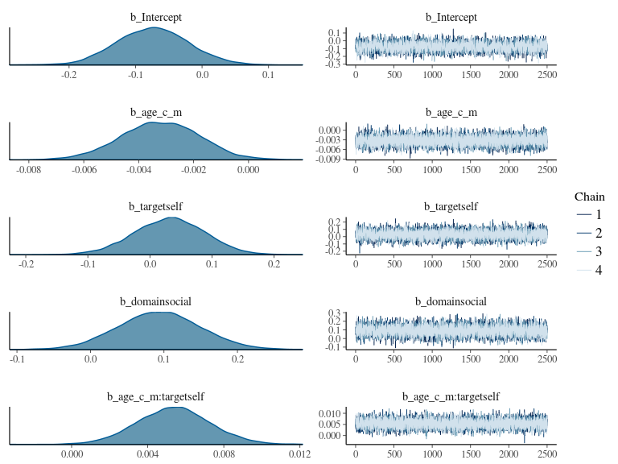

-   [Residual auto-correlation](#residual-auto-correlation)
    -   [quick, load the data](#quick-load-the-data)
    -   [Correct AR strucutre](#correct-ar-strucutre)
    -   [Some fun plots](#some-fun-plots)

Residual auto-correlation
=========================

After we went over the tutorial on playing with extracted ROI values in
a multilevel framework in R, Christy Rogers noted that we were not
correctly accounting for the fact that we're moding age continuously,
and thus with unequal spacing between our times of observation. The
default error covariance structure does not correctly account for this,
so we needed to find a way to specify the correct structure. For some
designs, this is very easy to do in `nlme`, using the command
`lme(..., correlation = corCAR1(form = ~ time_variable | grouping_variable))`.
However, `lme` rquires that there is only a single observations per
participant at every wave. In the ROI analysis example, we have a 2x2
factor design at every time of observation, and therefore have 4
observations per participant. Needless to say, `lme` complains. The best
solution I've been able to find so far is to use `brms`, which is based
on Stan. The estimation is Bayesian, but it's still pretty quick. He's a
rough comparison.

quick, load the data
--------------------

and packages, and do other stuff that you've already seen in the
`model_visualize_estimates` file.

    # set mirror from which to download packages
    osuRepo = 'http://ftp.osuosl.org/pub/cran/'

    if(!require(knitr)){
      install.packages('knitr',repos=osuRepo)
    }
    if(!require(dplyr)){
      install.packages('dplyr',repos=osuRepo)
    }
    if(!require(tidyr)){
      install.packages('tidyr',repos=osuRepo)
    }
    if(!require(ggplot2)){
      install.packages('ggplot2',repos=osuRepo)
    }
    if(!require(lme4)){
      install.packages('lme4',repos=osuRepo)
    }
    if(!require(wesanderson)){
      install.packages('wesanderson',repos=osuRepo)
    }
    if(!require(rmarkdown)){
      install.packages('rmarkdown',repos=osuRepo)
    }

    # load parameter estimate delimited .txt file
    data <- read.table('../../results/ROI_analysis/parameterEstimates.txt', sep = " ", fill = TRUE, stringsAsFactors=FALSE)

    # load age covariates and rename variables
    age <- read.csv('../../data/covariates/age.csv') %>%
      rename("subjectID" = Subj,
             "wave" = wavenum)

    # tidy raw data
    data1 <- data %>% 
      # rename variables
      rename('subjectID' = V1,
             'wave' = V2,
             'con' = V3,
             'parcellation' = V4,
             'beta' = V5,
             'sd' = V6) %>%
      # convert con file names to condition names
      mutate(target = ifelse(con %in% c('con_0001', 'con_0002'), 'self', 'other'), 
             domain = ifelse(con %in% c('con_0001', 'con_0003'), 'academic', 'social'), 
      # change data type to factor
             parcellation = as.factor(parcellation),
             target = as.factor(target),
             domain = as.factor(domain)) %>%
      # change to integer
      extract(wave, 'wave', 't([0-3]{1})') %>%
      mutate(wave = as.integer(wave))

    #Take every row in `age` that matches values in `data1` columns 'subjectID' and 'wave'
    merged <- left_join(data1, age, by = c('subjectID', 'wave')) %>%
      mutate(age_c = age-mean(age, na.rm=TRUE))

    data.complete = merged %>%
      na.omit(.)

Correct AR strucutre
--------------------

Estimate the model a couple different ways.

    if(!require(brms)){
      install.packages('brms',repos=osuRepo)
    }

    #brms::cor_ar can't handle totally continuous time -- it needs integer valued time, so we'll use months.
    model.data <- within(filter(data.complete, parcellation == 292), age_c_m <- round(age_c * 12))

    #A regular ole LMEM/HLM/MLM with the default error structure
    model2.lmer = lmer(beta ~ target*domain*age_c_m + (1 + age_c_m | subjectID), 
                   data=model.data) #filter gets us just the rows from parcel 292

    #The same HLM in brms
    model2.brm <- brms::brm(beta ~ 1 + age_c_m*target*domain + (1 + age_c_m | subjectID),
                            chains = 4,
                            iter = 5000,
                            cores = 4,
                            save_model = './brm_model.stan',
                            save_dso = TRUE,
                            data = model.data)

    #Now adding the cor_ar structure
    model2.brm_ar <- brms::brm(beta ~ 1 + age_c_m*target*domain + (1 + age_c_m | subjectID), 
                            autocor = brms::cor_ar(formula = ~ age_c_m | subjectID, p = 1),
                            chains = 4,
                            iter = 5000,
                            cores = 4,
                            save_model = './brm_ar_model.stan',
                            save_dso = TRUE,
                            data = model.data)

    summary(model2.lmer)

    ## Linear mixed model fit by REML ['lmerMod']
    ## Formula: beta ~ target * domain * age_c_m + (1 + age_c_m | subjectID)
    ##    Data: model.data
    ## 
    ## REML criterion at convergence: 1121.1
    ## 
    ## Scaled residuals: 
    ##     Min      1Q  Median      3Q     Max 
    ## -3.8156 -0.4812  0.0314  0.4536  4.3691 
    ## 
    ## Random effects:
    ##  Groups    Name        Variance  Std.Dev. Corr 
    ##  subjectID (Intercept) 9.288e-02 0.304762      
    ##            age_c_m     8.080e-06 0.002843 -0.60
    ##  Residual              2.520e-01 0.502041      
    ## Number of obs: 648, groups:  subjectID, 81
    ## 
    ## Fixed effects:
    ##                                  Estimate Std. Error t value
    ## (Intercept)                     -0.073471   0.052811  -1.391
    ## targetself                       0.031454   0.055943   0.562
    ## domainsocial                     0.093764   0.055943   1.676
    ## age_c_m                         -0.003179   0.001400  -2.271
    ## targetself:domainsocial          0.097146   0.079115   1.228
    ## targetself:age_c_m               0.005355   0.001876   2.855
    ## domainsocial:age_c_m             0.002488   0.001876   1.326
    ## targetself:domainsocial:age_c_m -0.005089   0.002653  -1.919
    ## 
    ## Correlation of Fixed Effects:
    ##             (Intr) trgtsl dmnscl ag_c_m trgts: trg:__ dmn:__
    ## targetself  -0.530                                          
    ## domainsocil -0.530  0.500                                   
    ## age_c_m     -0.003 -0.051 -0.051                            
    ## trgtslf:dmn  0.375 -0.707 -0.707  0.036                     
    ## trgtslf:g__ -0.040  0.076  0.038 -0.670 -0.054              
    ## dmnscl:g_c_ -0.040  0.038  0.076 -0.670 -0.054  0.500       
    ## trgtslf::__  0.028 -0.054 -0.054  0.474  0.076 -0.707 -0.707

    summary(model2.brm)

    ##  Family: gaussian(identity) 
    ## Formula: beta ~ 1 + age_c_m * target * domain + (1 + age_c_m | subjectID) 
    ##    Data: model.data (Number of observations: 648) 
    ## Samples: 4 chains, each with iter = 5000; warmup = 2500; thin = 1; 
    ##          total post-warmup samples = 10000
    ##     ICs: LOO = Not computed; WAIC = Not computed
    ##  
    ## Group-Level Effects: 
    ## ~subjectID (Number of levels: 81) 
    ##                        Estimate Est.Error l-95% CI u-95% CI Eff.Sample
    ## sd(Intercept)              0.31      0.04     0.25     0.39       3350
    ## sd(age_c_m)                0.00      0.00     0.00     0.01       2311
    ## cor(Intercept,age_c_m)    -0.49      0.32    -0.96     0.24       5967
    ##                        Rhat
    ## sd(Intercept)             1
    ## sd(age_c_m)               1
    ## cor(Intercept,age_c_m)    1
    ## 
    ## Population-Level Effects: 
    ##                                 Estimate Est.Error l-95% CI u-95% CI
    ## Intercept                          -0.07      0.05    -0.18     0.03
    ## age_c_m                             0.00      0.00    -0.01     0.00
    ## targetself                          0.03      0.06    -0.08     0.14
    ## domainsocial                        0.09      0.06    -0.02     0.20
    ## age_c_m:targetself                  0.01      0.00     0.00     0.01
    ## age_c_m:domainsocial                0.00      0.00     0.00     0.01
    ## targetself:domainsocial             0.10      0.08    -0.06     0.25
    ## age_c_m:targetself:domainsocial    -0.01      0.00    -0.01     0.00
    ##                                 Eff.Sample Rhat
    ## Intercept                             5257    1
    ## age_c_m                              10000    1
    ## targetself                           10000    1
    ## domainsocial                         10000    1
    ## age_c_m:targetself                   10000    1
    ## age_c_m:domainsocial                 10000    1
    ## targetself:domainsocial               8752    1
    ## age_c_m:targetself:domainsocial      10000    1
    ## 
    ## Family Specific Parameters: 
    ##       Estimate Est.Error l-95% CI u-95% CI Eff.Sample Rhat
    ## sigma      0.5      0.02     0.48     0.54      10000    1
    ## 
    ## Samples were drawn using sampling(NUTS). For each parameter, Eff.Sample 
    ## is a crude measure of effective sample size, and Rhat is the potential 
    ## scale reduction factor on split chains (at convergence, Rhat = 1).

    summary(model2.brm_ar)

    ##  Family: gaussian(identity) 
    ## Formula: beta ~ 1 + age_c_m * target * domain + (1 + age_c_m | subjectID) 
    ##    Data: model.data (Number of observations: 648) 
    ## Samples: 4 chains, each with iter = 5000; warmup = 2500; thin = 1; 
    ##          total post-warmup samples = 10000
    ##     ICs: LOO = Not computed; WAIC = Not computed
    ##  
    ## Group-Level Effects: 
    ## ~subjectID (Number of levels: 81) 
    ##                        Estimate Est.Error l-95% CI u-95% CI Eff.Sample
    ## sd(Intercept)              0.29      0.04     0.21     0.37       2635
    ## sd(age_c_m)                0.00      0.00     0.00     0.00       2463
    ## cor(Intercept,age_c_m)    -0.42      0.44    -0.98     0.69       6482
    ##                        Rhat
    ## sd(Intercept)             1
    ## sd(age_c_m)               1
    ## cor(Intercept,age_c_m)    1
    ## 
    ## Correlation Structure: arma(~age_c_m|subjectID, 1, 0, 0)
    ##       Estimate Est.Error l-95% CI u-95% CI Eff.Sample Rhat
    ## ar[1]     0.16      0.05     0.05     0.27       4204    1
    ## 
    ## Population-Level Effects: 
    ##                                 Estimate Est.Error l-95% CI u-95% CI
    ## Intercept                          -0.07      0.05    -0.18     0.03
    ## age_c_m                             0.00      0.00    -0.01     0.00
    ## targetself                          0.03      0.06    -0.08     0.14
    ## domainsocial                        0.09      0.05    -0.01     0.20
    ## age_c_m:targetself                  0.01      0.00     0.00     0.01
    ## age_c_m:domainsocial                0.00      0.00     0.00     0.01
    ## targetself:domainsocial             0.10      0.08    -0.05     0.26
    ## age_c_m:targetself:domainsocial     0.00      0.00    -0.01     0.00
    ##                                 Eff.Sample Rhat
    ## Intercept                             4045    1
    ## age_c_m                               8815    1
    ## targetself                            6692    1
    ## domainsocial                          6248    1
    ## age_c_m:targetself                    8936    1
    ## age_c_m:domainsocial                 10000    1
    ## targetself:domainsocial               5525    1
    ## age_c_m:targetself:domainsocial       8583    1
    ## 
    ## Family Specific Parameters: 
    ##       Estimate Est.Error l-95% CI u-95% CI Eff.Sample Rhat
    ## sigma     0.52      0.02     0.48     0.55       5444    1
    ## 
    ## Samples were drawn using sampling(NUTS). For each parameter, Eff.Sample 
    ## is a crude measure of effective sample size, and Rhat is the potential 
    ## scale reduction factor on split chains (at convergence, Rhat = 1).

    #this puts it in the same order as brms
    lmerorder <- c('(Intercept)',
                   'age_c_m',
                   'targetself',
                   'domainsocial',
                   'targetself:age_c_m',
                   'domainsocial:age_c_m',
                   'targetself:domainsocial',
                   'targetself:domainsocial:age_c_m')

    lmerfx <- coef(summary(model2.lmer))[lmerorder,]
    brmfx <- fixef(model2.brm)
    brmarfx <- fixef(model2.brm_ar)

    round(cbind(lmer=lmerfx[, 'Estimate'],
                brm=brmfx[, 'Estimate'],
                diff=lmerfx[, 'Estimate'] - brmfx[, 'Estimate']),5)

    ##                                     lmer      brm     diff
    ## (Intercept)                     -0.07347 -0.07391  0.00044
    ## age_c_m                         -0.00318 -0.00321  0.00003
    ## targetself                       0.03145  0.03157 -0.00012
    ## domainsocial                     0.09376  0.09367  0.00009
    ## targetself:age_c_m               0.00536  0.00537 -0.00002
    ## domainsocial:age_c_m             0.00249  0.00251 -0.00002
    ## targetself:domainsocial          0.09715  0.09666  0.00048
    ## targetself:domainsocial:age_c_m -0.00509 -0.00513  0.00004

    round(cbind(brm=brmfx[, 'Estimate'],
                brm_ar=brmarfx[, 'Estimate'],
                diff=brmfx[, 'Estimate'] - brmarfx[, 'Estimate']),5)

    ##                                      brm   brm_ar     diff
    ## Intercept                       -0.07391 -0.07497  0.00106
    ## age_c_m                         -0.00321 -0.00312 -0.00009
    ## targetself                       0.03157  0.02663  0.00494
    ## domainsocial                     0.09367  0.09321  0.00046
    ## age_c_m:targetself               0.00537  0.00514  0.00023
    ## age_c_m:domainsocial             0.00251  0.00254 -0.00003
    ## targetself:domainsocial          0.09666  0.10240 -0.00574
    ## age_c_m:targetself:domainsocial -0.00513 -0.00496 -0.00016

Some fun plots
--------------

First, we play with lmer plots, showing model predicted values over time
for each condition, and then the relation between observed and expected
values for each condition.

The `brms` plots are very Bayesian, showing the distribution of samples,
and the sampling chains.

    plot(model2.lmer, fitted(.)~age_c_m | interaction(target, domain))

    plot(model2.lmer, beta~fitted(.) | interaction(target, domain), abline = c(0,1))

    plot(model2.brm, ask = F)

    plot(model2.brm_ar, ask = F)

