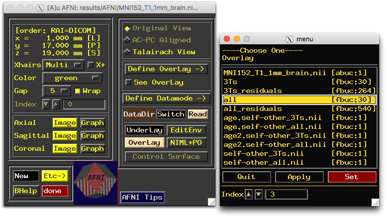
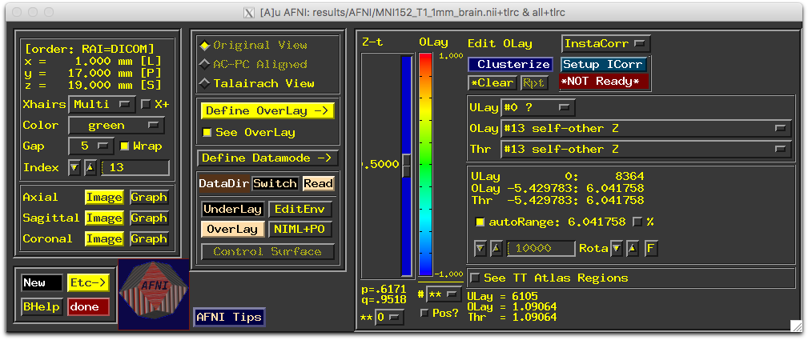
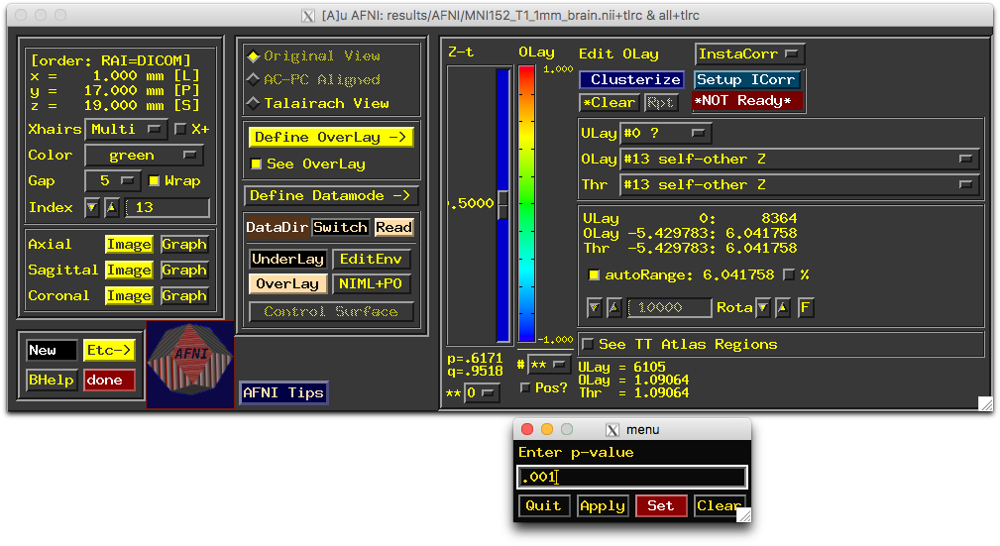
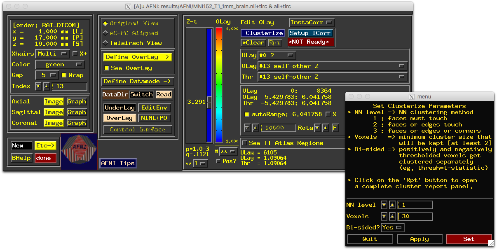
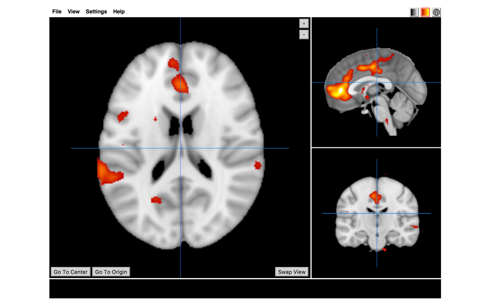

-   [Make 3dLME data table](#make-3dlme-data-table)
    -   [load packages](#load-packages)
    -   [load data](#load-data)
    -   [tidy data](#tidy-data)
    -   [exclude subjects based on motion and number of
        timepoints](#exclude-subjects-based-on-motion-and-number-of-timepoints)
    -   [merge data](#merge-data)
    -   [write files](#write-files)
-   [Make 3dLME bash script](#make-3dlme-bash-script)
    -   [Specify model](#specify-model)
    -   [Specify contrasts (glts)](#specify-contrasts-glts)
    -   [Specify data table (input files
        and design)](#specify-data-table-input-files-and-design)
    -   [Complete model](#complete-model)
-   [Run 3dLME model](#run-3dlme-model)
    -   [Dependencies](#dependencies)
    -   [Run model](#run-model)
        -   [1. In the terminal, the contents of the directory that
            holds that 3dLME bash
            script](#in-the-terminal-the-contents-of-the-directory-that-holds-that-3dlme-bash-script)
        -   [2. Change directories to the directory with `3dLME_all.sh`
            and execute the script. Pipe the output to
            `logs/3dLME_all.txt` and errors to
            `logs/3dLME_all_error.txt`](#change-directories-to-the-directory-with-3dlme_all.sh-and-execute-the-script.-pipe-the-output-to-logs3dlme_all.txt-and-errors-to-logs3dlme_all_error.txt)
        -   [3. Wait a while for the model to finish
            running](#wait-a-while-for-the-model-to-finish-running)
        -   [4. Check output file](#check-output-file)
        -   [5. Check results files in the output
            directory](#check-results-files-in-the-output-directory)
-   [View results in AFNI](#view-results-in-afni)
    -   [1. Open AFNI GUI](#open-afni-gui)
    -   [2. Select overlay by clicking on `Overlay` and choosing the
        model labeled
        `all`](#select-overlay-by-clicking-on-overlay-and-choosing-the-model-labeled-all)
    -   [3. Select contrast by clicking on `Olay` and `Thr` and
        selecting `self-other Z`
        in each.](#select-contrast-by-clicking-on-olay-and-thr-and-selecting-self-other-z-in-each.)
    -   [4. Select the p-value by right-clicking on
        `p=`](#select-the-p-value-by-right-clicking-on-p)
    -   [5. Select cluster forming threshold by clicking on
        `Clusterize`](#select-cluster-forming-threshold-by-clicking-on-clusterize)
-   [Convert AFNI files to nifti
    files](#convert-afni-files-to-nifti-files)
-   [View nifti files in R](#view-nifti-files-in-r)
-   [Helpful resources](#helpful-resources)

Make 3dLME data table
=====================

AFNI requires file information be in a [particular
format](https://afni.nimh.nih.gov/pub/dist/doc/program_help/3dLME.html).
`functional-workshop/code/RX_comparison/AFNI/make_3dLME_dataTable.Rmd`
is an example of a script that you could use to put your data into this
format.

This script takes first-level FX contrasts (each condition &gt; rest)
and age covariates to create the data table input for the 3dLME model.

load packages
-------------

    library(tidyverse)
    library(knitr)

load data
---------

    # load fx file names
    fxCons = data.frame(file = list.files('/Volumes/psych-cog/dsnlab/MDC/functional-workshop/data/FX_models/')) 

    # print header
    fxCons %>%
      head(6) %>%
      kable(format = 'pandoc')

<table>
<thead>
<tr class="header">
<th align="left">file</th>
</tr>
</thead>
<tbody>
<tr class="odd">
<td align="left">s001_t1_con_0001.nii</td>
</tr>
<tr class="even">
<td align="left">s001_t1_con_0002.nii</td>
</tr>
<tr class="odd">
<td align="left">s001_t1_con_0003.nii</td>
</tr>
<tr class="even">
<td align="left">s001_t1_con_0004.nii</td>
</tr>
<tr class="odd">
<td align="left">s001_t2_con_0001.nii</td>
</tr>
<tr class="even">
<td align="left">s001_t2_con_0002.nii</td>
</tr>
</tbody>
</table>

    # load age
    covariates = read.csv('/Volumes/psych-cog/dsnlab/MDC/functional-workshop/data/covariates/age.csv')

    # print header
    covariates %>%
      head(6) %>%
      kable(format = 'pandoc')

<table>
<thead>
<tr class="header">
<th align="left">Subj</th>
<th align="right">wavenum</th>
<th align="right">age</th>
</tr>
</thead>
<tbody>
<tr class="odd">
<td align="left">s001</td>
<td align="right">1</td>
<td align="right">10.415301</td>
</tr>
<tr class="even">
<td align="left">s001</td>
<td align="right">2</td>
<td align="right">13.487671</td>
</tr>
<tr class="odd">
<td align="left">s002</td>
<td align="right">1</td>
<td align="right">10.831454</td>
</tr>
<tr class="even">
<td align="left">s003</td>
<td align="right">1</td>
<td align="right">10.538251</td>
</tr>
<tr class="odd">
<td align="left">s004</td>
<td align="right">1</td>
<td align="right">9.718617</td>
</tr>
<tr class="even">
<td align="left">s005</td>
<td align="right">1</td>
<td align="right">9.908084</td>
</tr>
</tbody>
</table>

tidy data
---------

    # center age and create quadratic term for age
    covariates = covariates %>%
      mutate(age_c = age-13,
             age_c2 = age_c^2) %>%
      select(Subj, wavenum, starts_with("age_c"))

    # extract condition information from contrast files
    fxCons = fxCons %>%
      extract(file, c("Subj","wavenum","con"), 
              regex = "(s[0-9]{3})_t([0-3]{1})_(con_[0-4]{4}).nii", 
              remove = FALSE) %>%
      mutate(domain = ifelse(con %in% c("con_0001", "con_0003"), "academic", "social"),
             target = ifelse(con %in% c("con_0001", "con_0002"), "self", "other"),
             InputFile = paste0('/Volumes/psych-cog/dsnlab/MDC/functional-workshop/data/FX_models/',file),
             wavenum = as.integer(wavenum))

exclude subjects based on motion and number of timepoints
---------------------------------------------------------

    # exclude subjects based on motion
    motion.exclusions = c('s002_t1', 's004_t1', 's008_t1', 's011_t1', 's017_t1', 's026_t1', 's033_t2', 's034_t1', 's041_t1', 's044_t1', 's047_t1', 's051_t1', 's054_t1', 's057_t1', 's059_t1', 's061_t1', 's063_t1', 's070_t2', 's074_t1', 's074_t2', 's078_t1', 's084_t1', 's090_t2', 's090_t3', 's094_t1', 's094_t2', 's096_t1')
    included.motion = fxCons %>% filter(!grepl(paste(motion.exclusions,collapse="|"), file))

    # exclude all subjects that do not have all 3 timepoints
    inclusions.3Ts = c('s005', 's016', 's018', 's019', 's022', 's023', 's024', 's029', 's030', 's032', 's035', 's038', 's040', 's042', 's045', 's058', 's064', 's065', 's072', 's073', 's081', 's089')
    included.3Ts = fxCons %>% filter(grepl(paste(inclusions.3Ts, collapse="|"), Subj))

merge data
----------

    age.motion = left_join(included.motion, covariates, by = c("Subj", "wavenum")) %>%
      select(Subj, target, domain, starts_with("age_c"), InputFile) %>%
      filter(!is.na(age_c))

    age.3Ts = left_join(included.3Ts, covariates, by = c("Subj", "wavenum")) %>%
      select(Subj, target, domain, starts_with("age_c"), InputFile) %>%
      filter(!is.na(age_c))

    # print header
    age.motion %>%
      head(10) %>%
      kable(format = 'pandoc')

<table>
<thead>
<tr class="header">
<th align="left">Subj</th>
<th align="left">target</th>
<th align="left">domain</th>
<th align="right">age_c</th>
<th align="right">age_c2</th>
<th align="left">InputFile</th>
</tr>
</thead>
<tbody>
<tr class="odd">
<td align="left">s001</td>
<td align="left">self</td>
<td align="left">academic</td>
<td align="right">-2.5846995</td>
<td align="right">6.6806712</td>
<td align="left">/Volumes/psych-cog/dsnlab/MDC/functional-workshop/data/FX_models/s001_t1_con_0001.nii</td>
</tr>
<tr class="even">
<td align="left">s001</td>
<td align="left">self</td>
<td align="left">social</td>
<td align="right">-2.5846995</td>
<td align="right">6.6806712</td>
<td align="left">/Volumes/psych-cog/dsnlab/MDC/functional-workshop/data/FX_models/s001_t1_con_0002.nii</td>
</tr>
<tr class="odd">
<td align="left">s001</td>
<td align="left">other</td>
<td align="left">academic</td>
<td align="right">-2.5846995</td>
<td align="right">6.6806712</td>
<td align="left">/Volumes/psych-cog/dsnlab/MDC/functional-workshop/data/FX_models/s001_t1_con_0003.nii</td>
</tr>
<tr class="even">
<td align="left">s001</td>
<td align="left">other</td>
<td align="left">social</td>
<td align="right">-2.5846995</td>
<td align="right">6.6806712</td>
<td align="left">/Volumes/psych-cog/dsnlab/MDC/functional-workshop/data/FX_models/s001_t1_con_0004.nii</td>
</tr>
<tr class="odd">
<td align="left">s001</td>
<td align="left">self</td>
<td align="left">academic</td>
<td align="right">0.4876712</td>
<td align="right">0.2378232</td>
<td align="left">/Volumes/psych-cog/dsnlab/MDC/functional-workshop/data/FX_models/s001_t2_con_0001.nii</td>
</tr>
<tr class="even">
<td align="left">s001</td>
<td align="left">self</td>
<td align="left">social</td>
<td align="right">0.4876712</td>
<td align="right">0.2378232</td>
<td align="left">/Volumes/psych-cog/dsnlab/MDC/functional-workshop/data/FX_models/s001_t2_con_0002.nii</td>
</tr>
<tr class="odd">
<td align="left">s001</td>
<td align="left">other</td>
<td align="left">academic</td>
<td align="right">0.4876712</td>
<td align="right">0.2378232</td>
<td align="left">/Volumes/psych-cog/dsnlab/MDC/functional-workshop/data/FX_models/s001_t2_con_0003.nii</td>
</tr>
<tr class="even">
<td align="left">s001</td>
<td align="left">other</td>
<td align="left">social</td>
<td align="right">0.4876712</td>
<td align="right">0.2378232</td>
<td align="left">/Volumes/psych-cog/dsnlab/MDC/functional-workshop/data/FX_models/s001_t2_con_0004.nii</td>
</tr>
<tr class="odd">
<td align="left">s003</td>
<td align="left">self</td>
<td align="left">academic</td>
<td align="right">-2.4617486</td>
<td align="right">6.0602063</td>
<td align="left">/Volumes/psych-cog/dsnlab/MDC/functional-workshop/data/FX_models/s003_t1_con_0001.nii</td>
</tr>
<tr class="even">
<td align="left">s003</td>
<td align="left">self</td>
<td align="left">social</td>
<td align="right">-2.4617486</td>
<td align="right">6.0602063</td>
<td align="left">/Volumes/psych-cog/dsnlab/MDC/functional-workshop/data/FX_models/s003_t1_con_0002.nii</td>
</tr>
</tbody>
</table>

write files
-----------

    write.table(age.motion, '/Volumes/psych-cog/dsnlab/MDC/functional-workshop/code/RX_comparison/AFNI/model_all.txt', sep = "\t", quote=FALSE, row.names = FALSE)
    write.table(age.3Ts, '/Volumes/psych-cog/dsnlab/MDC/functional-workshop/code/RX_comparison/AFNI/model_3Ts.txt', sep = "\t", quote=FALSE, row.names = FALSE)

Make 3dLME bash script
======================

To run the 3dLME model, you will need to create and execute a bash
script in which your model is specified.

Path to bash script:
`functional-workshop/code/RX_comparison/AFNI/3dLME_all.sh`

    #!/bin/bash
    . ~/.bashrc

    # Change directory to the model results folder
    cd /Volumes/psych-cog/dsnlab/MDC/functional-workshop/results/AFNI

    # Specify 3dLME model
    # AFNI documentation https://afni.nimh.nih.gov/pub/dist/doc/program_help/3dLME.html
    # Every line in the model must be followed by '\'
    #   - prefix = model name
    #   - jobs = number of parallel processors
    #   - model = model formula
    #   - resid = residual file name 
    #   - ranEff = random effects, 1 = intercept
    #   - SS_type = sum of squares type, 3 = marginal
    #   - qVars = quantitative variables
    #   - qVars = centering values for quantitative variables
    #   - mask = binarized group-level mask
    #   - num_glt = number of contrasts (i.e. general linear tests)
    #   - gltLabel k = contrast label for contrast k
    #   - gltCode k = contrast code for contrast k
    #   - datatable = data structure with a header

    3dLME -prefix all \
        -jobs 8 \
        -model  "target*domain*age_c+target*domain*age_c2" \
        -resid  all_residuals   \
        -ranEff "~1+age_c" \
        -SS_type 3 \
        -qVars "age_c,age_c2" \
        -qVarCenters "0,0" \
        -mask /Volumes/psych-cog/dsnlab/MDC/functional-workshop/data/RX_mask/groupAverage_opt.nii \
        -num_glt 9 \
        -gltLabel 1 'self-other' -gltCode  1 'target : 1*self -1*other' \
        -gltLabel 2 'social-academic' -gltCode  2 'domain : 1*social -1*academic' \
        -gltLabel 3 'self-other.social-academic' -gltCode  3 'target : 1*self -1*other domain : 1*social -1*academic' \
        -gltLabel 4 'social_self-other' -gltCode  4 'target : 1*self -1*other domain : 1*social' \
        -gltLabel 5 'academic_self-other' -gltCode  5 'target : 1*self -1*other domain : 1*academic' \
        -gltLabel 6 'age.self-other' -gltCode  6 'target : 1*self -1*other age_c : ' \
        -gltLabel 7 'age2.self-other' -gltCode  7 'target : 1*self -1*other age_c2 : ' \
        -gltLabel 8 'age.self-other.social-academic' -gltCode  8 'target : 1*self -1*other domain : 1*social -1*academic age_c : ' \
        -gltLabel 9 'age2.self-other.social-academic' -gltCode  9 'target : 1*self -1*other domain : 1*social -1*academic age_c2 : ' \
        -dataTable \
        Subj    target  domain  age_c   age_c2  InputFile \
        s001    self    academic    -2.58469945 6.6806712468303 /Volumes/psych-cog/dsnlab/MDC/functional-workshop/data/FX_models/s001_t1_con_0001.nii \
        s001    self    social  -2.58469945 6.6806712468303 /Volumes/psych-cog/dsnlab/MDC/functional-workshop/data/FX_models/s001_t1_con_0002.nii \
        s001    other   academic    -2.58469945 6.6806712468303 /Volumes/psych-cog/dsnlab/MDC/functional-workshop/data/FX_models/s001_t1_con_0003.nii \
        s001    other   social  -2.58469945 6.6806712468303 /Volumes/psych-cog/dsnlab/MDC/functional-workshop/data/FX_models/s001_t1_con_0004.nii \
        s001    self    academic    0.48767123  0.237823228569713   /Volumes/psych-cog/dsnlab/MDC/functional-workshop/data/FX_models/s001_t2_con_0001.nii \
        s001    self    social  0.48767123  0.237823228569713   /Volumes/psych-cog/dsnlab/MDC/functional-workshop/data/FX_models/s001_t2_con_0002.nii \
        s001    other   academic    0.48767123  0.237823228569713   /Volumes/psych-cog/dsnlab/MDC/functional-workshop/data/FX_models/s001_t2_con_0003.nii \
        s001    other   social  0.48767123  0.237823228569713   /Volumes/psych-cog/dsnlab/MDC/functional-workshop/data/FX_models/s001_t2_con_0004.nii \
        s003    self    academic    -2.46174863 6.06020631730688    /Volumes/psych-cog/dsnlab/MDC/functional-workshop/data/FX_models/s003_t1_con_0001.nii \
        s003    self    social  -2.46174863 6.06020631730688    /Volumes/psych-cog/dsnlab/MDC/functional-workshop/data/FX_models/s003_t1_con_0002.nii \
    .
    .
    .
        s096    other   social  -0.12804102 0.0163945028026403  /Volumes/psych-cog/dsnlab/MDC/functional-workshop/data/FX_models/s096_t2_con_0004.nii \

Specify model
-------------

-   prefix = model name
-   jobs = number of parallel processors
-   model = model formula
-   ranEff = random effects, 1 = intercept
-   SS\_type = sum of squares type, 3 = marginal
-   qVars = quantitative variables
-   qVars = centering values for quantitative variables
-   mask = binarized group-level mask
-   resid = residual file name

<!-- -->

    3dLME -prefix all \
        -jobs 8 \
        -model  "target*domain*age_c+target*domain*age_c2" \
        -ranEff "~1+age_c" \
        -SS_type 3 \
        -qVars "age_c,age_c2" \
        -qVarCenters "0,0" \
        -mask /Volumes/psych-cog/dsnlab/MDC/functional-workshop/data/RX_mask/groupAverage_opt.nii \
        -resid  all_residuals   \

Specify contrasts (glts)
------------------------

-   num\_glt = number of contrasts (i.e. general linear tests)
-   gltLabel k = contrast label for contrast k
-   gltCode k = contrast code for contrast k

<!-- -->

        -num_glt 9 \
        -gltLabel 1 'self-other' -gltCode  1 'target : 1*self -1*other' \
        -gltLabel 2 'social-academic' -gltCode  2 'domain : 1*social -1*academic' \
        -gltLabel 3 'self-other.social-academic' -gltCode  3 'target : 1*self -1*other domain : 1*social -1*academic' \
        -gltLabel 4 'social_self-other' -gltCode  4 'target : 1*self -1*other domain : 1*social' \
        -gltLabel 5 'academic_self-other' -gltCode  5 'target : 1*self -1*other domain : 1*academic' \
        -gltLabel 6 'age.self-other' -gltCode  6 'target : 1*self -1*other age_c : ' \
        -gltLabel 7 'age2.self-other' -gltCode  7 'target : 1*self -1*other age_c2 : ' \
        -gltLabel 8 'age.self-other.social-academic' -gltCode  8 'target : 1*self -1*other domain : 1*social -1*academic age_c : ' \
        -gltLabel 9 'age2.self-other.social-academic' -gltCode  9 'target : 1*self -1*other domain : 1*social -1*academic age_c2 : ' \

Specify data table (input files and design)
-------------------------------------------

-   datatable = data structure with a header
-   format = subject, condition 1, condition 1, continuous variable 1,
    continuous variable 2, input file
-   Name requirements
-   subject ID column must be named `Subj`
-   file column must be named `InputFile`

<!-- -->

        -dataTable \
        Subj    target  domain  age_c   age_c2  InputFile \
        s001    self    academic    -2.58469945 6.6806712468303 /Volumes/psych-cog/dsnlab/MDC/functional-workshop/data/FX_models/s001_t1_con_0001.nii \
        s001    self    social  -2.58469945 6.6806712468303 /Volumes/psych-cog/dsnlab/MDC/functional-workshop/data/FX_models/s001_t1_con_0002.nii \
        s001    other   academic    -2.58469945 6.6806712468303 /Volumes/psych-cog/dsnlab/MDC/functional-workshop/data/FX_models/s001_t1_con_0003.nii \
        s001    other   social  -2.58469945 6.6806712468303 /Volumes/psych-cog/dsnlab/MDC/functional-workshop/data/FX_models/s001_t1_con_0004.nii \
        s001    self    academic    0.48767123  0.237823228569713   /Volumes/psych-cog/dsnlab/MDC/functional-workshop/data/FX_models/s001_t2_con_0001.nii \
        s001    self    social  0.48767123  0.237823228569713   /Volumes/psych-cog/dsnlab/MDC/functional-workshop/data/FX_models/s001_t2_con_0002.nii \
        s001    other   academic    0.48767123  0.237823228569713   /Volumes/psych-cog/dsnlab/MDC/functional-workshop/data/FX_models/s001_t2_con_0003.nii \
        s001    other   social  0.48767123  0.237823228569713   /Volumes/psych-cog/dsnlab/MDC/functional-workshop/data/FX_models/s001_t2_con_0004.nii \
        s003    self    academic    -2.46174863 6.06020631730688    /Volumes/psych-cog/dsnlab/MDC/functional-workshop/data/FX_models/s003_t1_con_0001.nii \
        s003    self    social  -2.46174863 6.06020631730688    /Volumes/psych-cog/dsnlab/MDC/functional-workshop/data/FX_models/s003_t1_con_0002.nii \
    .
    .
    .
        s096    other   social  -0.12804102 0.0163945028026403  /Volumes/psych-cog/dsnlab/MDC/functional-workshop/data/FX_models/s096_t2_con_0004.nii \

Complete model
--------------

    3dLME -prefix all \
        -jobs 8 \
        -model  "target*domain*age_c+target*domain*age_c2" \
        -resid  all_residuals   \
        -ranEff "~1+age_c" \
        -SS_type 3 \
        -qVars "age_c,age_c2" \
        -qVarCenters "0,0" \
        -mask /Volumes/psych-cog/dsnlab/MDC/functional-workshop/data/RX_mask/groupAverage_opt.nii \
        -num_glt 9 \
        -gltLabel 1 'self-other' -gltCode  1 'target : 1*self -1*other' \
        -gltLabel 2 'social-academic' -gltCode  2 'domain : 1*social -1*academic' \
        -gltLabel 3 'self-other.social-academic' -gltCode  3 'target : 1*self -1*other domain : 1*social -1*academic' \
        -gltLabel 4 'social_self-other' -gltCode  4 'target : 1*self -1*other domain : 1*social' \
        -gltLabel 5 'academic_self-other' -gltCode  5 'target : 1*self -1*other domain : 1*academic' \
        -gltLabel 6 'age.self-other' -gltCode  6 'target : 1*self -1*other age_c : ' \
        -gltLabel 7 'age2.self-other' -gltCode  7 'target : 1*self -1*other age_c2 : ' \
        -gltLabel 8 'age.self-other.social-academic' -gltCode  8 'target : 1*self -1*other domain : 1*social -1*academic age_c : ' \
        -gltLabel 9 'age2.self-other.social-academic' -gltCode  9 'target : 1*self -1*other domain : 1*social -1*academic age_c2 : ' \
        -dataTable \
        Subj    target  domain  age_c   age_c2  InputFile \
        s001    self    academic    -2.58469945 6.6806712468303 /Volumes/psych-cog/dsnlab/MDC/functional-workshop/data/FX_models/s001_t1_con_0001.nii \
        s001    self    social  -2.58469945 6.6806712468303 /Volumes/psych-cog/dsnlab/MDC/functional-workshop/data/FX_models/s001_t1_con_0002.nii \
        s001    other   academic    -2.58469945 6.6806712468303 /Volumes/psych-cog/dsnlab/MDC/functional-workshop/data/FX_models/s001_t1_con_0003.nii \
        s001    other   social  -2.58469945 6.6806712468303 /Volumes/psych-cog/dsnlab/MDC/functional-workshop/data/FX_models/s001_t1_con_0004.nii \
        s001    self    academic    0.48767123  0.237823228569713   /Volumes/psych-cog/dsnlab/MDC/functional-workshop/data/FX_models/s001_t2_con_0001.nii \
        s001    self    social  0.48767123  0.237823228569713   /Volumes/psych-cog/dsnlab/MDC/functional-workshop/data/FX_models/s001_t2_con_0002.nii \
        s001    other   academic    0.48767123  0.237823228569713   /Volumes/psych-cog/dsnlab/MDC/functional-workshop/data/FX_models/s001_t2_con_0003.nii \
        s001    other   social  0.48767123  0.237823228569713   /Volumes/psych-cog/dsnlab/MDC/functional-workshop/data/FX_models/s001_t2_con_0004.nii \
        s003    self    academic    -2.46174863 6.06020631730688    /Volumes/psych-cog/dsnlab/MDC/functional-workshop/data/FX_models/s003_t1_con_0001.nii \
        s003    self    social  -2.46174863 6.06020631730688    /Volumes/psych-cog/dsnlab/MDC/functional-workshop/data/FX_models/s003_t1_con_0002.nii \
    .
    .
    .
        s096    other   social  -0.12804102 0.0163945028026403  /Volumes/psych-cog/dsnlab/MDC/functional-workshop/data/FX_models/s096_t2_con_0004.nii \

Run 3dLME model
===============

Dependencies
------------

-   AFNI must be installed. Follow the instructions in the [AFNI
    installation
    guide](https://afni.nimh.nih.gov/pub/dist/doc/htmldoc/background_install/install_instructs/index.html)
-   IF you're running the script locally, make sure the path to AFNI is
    in your bash environment `~/.bashrc`; if not, export the path to
    your local version of AFNI using
    `export PATH=$PATH:/Users/danicosme/AFNI_17.0.12/`
-   If you're running it on an HPC clustster, make sure AFNI is loaded
    in the script; replace `. ~/.bashrc` with `module load afni` or
    similar
-   3dLME runs using R. To ensure all required R packages are installed,
    execute this AFNI command: `sudo rPkgsInstall -pkgs ALL`

Run model
---------

#### 1. In the terminal, the contents of the directory that holds that 3dLME bash script

    echo /Volumes/psych-cog/dsnlab/MDC/functional-workshop/code/RX_comparison/AFNI
    ls -l /Volumes/psych-cog/dsnlab/MDC/functional-workshop/code/RX_comparison/AFNI

    ## /Volumes/psych-cog/dsnlab/MDC/functional-workshop/code/RX_comparison/AFNI
    ## total 496
    ## -rwx------  1 danicosme  staff  38616 Sep 12 16:26 3dLME_3Ts.sh
    ## -rwx------  1 danicosme  staff  76690 Sep 12 16:26 3dLME_all.sh
    ## -rwx------  1 danicosme  staff   1031 Sep  2 15:57 convert_AFNItoNIFTI.sh
    ## drwx------  1 danicosme  staff  16384 Sep 12 18:00 logs
    ## -rwx------  1 danicosme  staff   3087 Sep 12 16:23 make_3dLME_dataTable.Rmd
    ## -rwx------  1 danicosme  staff  35810 Sep 12 18:37 model_3Ts.txt
    ## -rwx------  1 danicosme  staff  73056 Sep 12 18:37 model_all.txt

#### 2. Change directories to the directory with `3dLME_all.sh` and execute the script. Pipe the output to `logs/3dLME_all.txt` and errors to `logs/3dLME_all_error.txt`

    cd /Volumes/psych-cog/dsnlab/MDC/functional-workshop/code/RX_comparison/AFNI
    bash 3dLME_all.sh > logs/3dLME_all.txt 2> logs/3dLME_all_error.txt

#### 3. Wait a while for the model to finish running

#### 4. Check output file

    more /Volumes/psych-cog/dsnlab/MDC/functional-workshop/code/RX_comparison/AFNI/logs/3dLME_all.txt

#### 5. Check results files in the output directory

    ls -l /Volumes/psych-cog/dsnlab/MDC/functional-workshop/results/AFNI

    ## total 620168
    ## -rwx------  1 danicosme  staff   10417680 Aug 29 18:28 3Ts+tlrc.BRIK
    ## -rwx------  1 danicosme  staff      81412 Aug 29 18:28 3Ts+tlrc.HEAD
    ## -rwx------  1 danicosme  staff   91675584 Aug 29 18:28 3Ts_residuals+tlrc.BRIK
    ## -rwx------  1 danicosme  staff      53101 Aug 29 18:28 3Ts_residuals+tlrc.HEAD
    ## -rwx------  1 danicosme  staff       3782 Aug 30 17:45 3dFWHMx.1D
    ## -rwx------  1 danicosme  staff      17118 Aug 30 17:47 3dFWHMx.1D.png
    ## -rwx------  1 danicosme  staff   14442416 Sep 10  2015 MNI152_T1_1mm_brain.nii
    ## -rwx------  1 danicosme  staff     418328 Sep 12 18:25 age.self-other_3Ts.nii
    ## -rwx------  1 danicosme  staff     456040 Sep 12 18:25 age.self-other_all.nii
    ## -rwx------  1 danicosme  staff     418312 Sep 12 18:25 age2.self-other_3Ts.nii
    ## -rwx------  1 danicosme  staff     456040 Sep 12 18:25 age2.self-other_all.nii
    ## -rwx------  1 danicosme  staff   10417680 Aug 29 19:19 all+tlrc.BRIK
    ## -rwx------  1 danicosme  staff     120060 Aug 29 19:19 all+tlrc.HEAD
    ## -rwx------  1 danicosme  staff  187518240 Aug 29 19:20 all_residuals+tlrc.BRIK
    ## -rwx------  1 danicosme  staff     105202 Aug 29 19:19 all_residuals+tlrc.HEAD
    ## drwx------  1 danicosme  staff      16384 Sep 12 17:58 backup
    ## -rwx------  1 danicosme  staff     418136 Sep 12 18:25 self-other_3Ts.nii
    ## -rwx------  1 danicosme  staff     456168 Sep 12 18:25 self-other_all.nii

View results in AFNI
====================

#### 1. Open AFNI GUI

    cd /Volumes/psych-cog/dsnlab/MDC/functional-workshop/results/AFNI
    afni&

#### 2. Select overlay by clicking on `Overlay` and choosing the model labeled `all`

#### 3. Select contrast by clicking on `Olay` and `Thr` and selecting `self-other Z` in each.

-   Choosing the `Z` map will give the map of z-values, whereas the
    other map is the map of parameter estimates
-   `Thr` is the map that is used for thresholding.

#### 4. Select the p-value by right-clicking on `p=`

-   If you have trouble entering values into the GUI, use
    `echo 'export DYLD_LIBRARY_PATH=/opt/X11/lib/flat_namespace' >> ~/.bashrc`

#### 5. Select cluster forming threshold by clicking on `Clusterize`

Convert AFNI files to nifti files
=================================

Conversion script path:
`/Volumes/psych-cog/dsnlab/MDC/functional-workshop/code/RX_comparison/AFNI/convert_AFNItoNIFTI.sh`

    #!/bin/bash
    . ~/.bashrc

    # Define path to AFNI results directory, model names, and contrast numbers
    # ------------------------------------------------------------------------------------------
    resultsDir=/Volumes/psych-cog/dsnlab/MDC/functional-workshop/results/AFNI
    thresholdedDir=/Volumes/psych-cog/dsnlab/MDC/functional-workshop/results/thresholdedMaps
    models=(3Ts all)
    selfOther=13
    age_selfOther=23
    age2_selfOther=25

    # Convert AFNI contrasts to nifti files
    # ------------------------------------------------------------------------------------------
    # AFNI documentation https://afni.nimh.nih.gov/pub/dist/doc/program_help/3dAFNItoNIFTI.html
    for model in  "${models[@]}" ; do
        3dAFNItoNIFTI -prefix "${resultsDir}"/self-other_"${model}" "${resultsDir}"/"${model}"+tlrc["${selfOther}"]
        3dAFNItoNIFTI -prefix "${resultsDir}"/age.self-other_"${model}" "${resultsDir}"/"${model}"+tlrc["${age_selfOther}"]
        3dAFNItoNIFTI -prefix "${resultsDir}"/age2.self-other_"${model}" "${resultsDir}"/"${model}"+tlrc["${age2_selfOther}"]
    done

View nifti files in R
=====================

    library(fslr)
    library(papayar)
    structural = readnii('/Volumes/psych-cog/dsnlab/MDC/functional-workshop/results/AFNI/MNI152_T1_1mm_brain.nii')
    contrast = readnii('/Volumes/psych-cog/dsnlab/MDC/functional-workshop/results/AFNI/self-other_all.nii')

    papaya(list(structural,contrast))

Helpful resources
=================

-   [AFNI installation
    guide](https://afni.nimh.nih.gov/pub/dist/doc/htmldoc/background_install/install_instructs/index.html)
-   [AFNI 3dLME help
    guide](https://afni.nimh.nih.gov/pub/dist/doc/program_help/3dLME.html)
-   [AFNI message
    board](https://afni.nimh.nih.gov/afni/community/board/)
